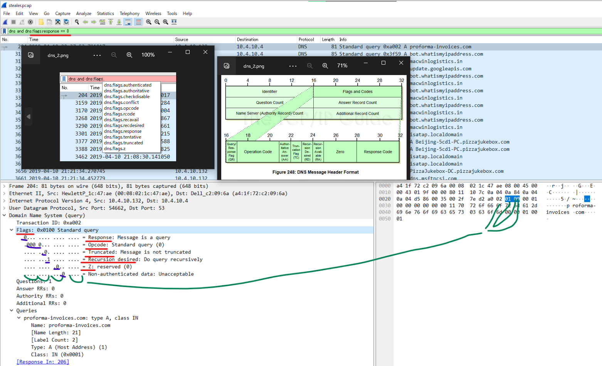

# WriteUps
## lesson
- how to detect dns query. about DNS frame structure around flag(#11)
  
- MAXMIND's GeoIP Database for Wireshark
  
- how to check email server's software(#21)
  


## #1
```
$ capinfos ./stealer.pcap
```

## #2
```
$ capinfos ./stealer.pcap
$ date --date '2019-04-11 05:37:07 JST' --utc '+%Y-%m-%d %H:%M:%S %Z'
```

## #3
```
$ capinfos stealer.pcap -u
$ i=3821 && sec=$((i%60)) && min=$((i%3600/60)) && hrs=$((i/3600)) && echo $(printf "%02d:%02d:%02d" $hrs $min $sec)
```

## #4
NetworkMiner

## #5
NetworkMiner

## #6
Google

## #6
NetworkMiner
The answer includes IP which looks like a network device.

## #7
NetworkMiner

## #8
NetworkMiner

## #9
NetworkMiner

## #10
Wireshark
```
frame.number == 204
```

## #11
Wireshark
```
frame.number gt 203 && dns
```

## #12
```
$ whois 217[.]182.138.150 | grep -i country
```

## #13
Wireshark.  
check UserAgemt of malicious HTTP connections.  
  
I think this is not good question.
Windows NT 6.1 should be called OS version??

## #14
Arkime
```
ip == 217[.]182.138.150
```

## #15
Arkime

## #16
VT

## #17
NetworkMiner
caution: use copy otherwise use misunderstand the spell

## #18
NetworkMiner, Arkime, Wireshark

## #19
Arikime
```
$ whois 23[.]229.162.69 | grep -i country
```

## #20
check mail domain
```
whois macwinlogistics.in
```

## #21
Wireshark.  
check SMTP 220

## #22
NetworkMiner

## #23
NetworkMiner

## #24
Arkime

## #25
NetworkMiner

## #26
Arkime
