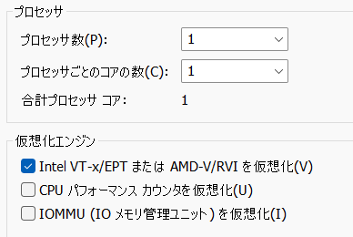

# TOC
- [CTF environment](#ctf-environment)
  - [HOST](#host)
    - [VMWare Workstaion](#vmware-workstation)
    - [cmd](#cmd)
  - [Setup VM](#setup-vm)
    - [Windows OS](#windows-os)
        - [GUI app](#gui-app)
        - [WSL](#wsl)
            - [.zshrc](#zshrc)
            - [Vim](#vim)
            - [wsl.conf](#etcwslconf)
            - [VSCode](#vscode)
            - [setup](#setup)
            - [elasticsearch for arkime](#elasticsearch-for-arkime)
  - [How to Write Script](#)

# CTF environment
## HOST
### VMWare Workstation
put on Intel VT-x/EPT Virtualization  
 

### cmd
hyper-v off is needed to use WSL on VM.  
```
bcdedit /set hypervisorlaunchtype off
```

## Setup VM
### Windows OS
system sound off due to noisy at click tab many times.

#### GUI App
- 7zip
- Process Hacker
- Wireshark
- Geo IP Database for Wireshark  
https://wiki.wireshark.org/HowToUseGeoIP#:~:text=MaxMind%20produces%20databases%20and%20software,information%20for%20an%20IP%20address.
- うさみみハリケーン
- BurpSuite
- Firefox
set CA and FoxyProxy for BurpSuite
- VSCode
  - extensions
    - zenkaku
    - Highlight Trailing White Spaces
    - WSL
- Tablacus Explorer
  - Add-on
    - split
    - split 3
    - split 6
    - Dark Mode
- Exeinfo PE
- Office
  - Word
  - Excel
  - PowerPoint
  - Outlook
  - OneNote
  - Teams
- CMD Watcher  
https://www.kahusecurity.com/tools.html  
- OpenVPN
- Sysinternals Suite
https://learn.microsoft.com/ja-jp/sysinternals/downloads/sysinternals-suite
  
#### WSL
##### when you fail `apt update`
- Becasuse of a time difference between host and guset machine on WSL.  
So, 'WSL restart' will be needed.  
But sometimes, a time of host machine VM will be off.  
Then you must update host machine's one.
```
// At Host Machine
$ wsl --shutdown
$ wsl
```

##### ~/.zshrc
```
# my setting
# setxkbmap -layout jp
eval $(dircolors -b ~/.dircolors)
alias ll='ls -l'
alias la='ls -la'
alias grep='grep --color'
alias win='cd /mnt/c/Users/user'
alias lin='cd ~/'
alias ..='cd ..'
alias clip='/mnt/c/WINDOWS/system32/clip.exe'
alias pa2='source /home/user/virtual_py2.7/bin/activate'
alias pa2v='source /home/user/virtual_py2.7_ViperMonkey/bin/activate'
alias pa3='source /home/user/virtual_py3.10/bin/activate'
alias pa3j='source /home/user/virtual_py3.10_jupyterlab/bin/activate'
alias pd='deactivate'
alias vol2='sudo ~/virtual_py2/bin/python2.7 ~/volatility/vol.py'
alias vol3='sudo ~/virtual_py3/bin/python3.10 ~/volatility3/vol.py'
alias volshell3='sudo ~/virtual_py3/bin/python3 ~/volatility3/volshell.py'
alias a='uname -a'
alias elasticsearch='/home/user/arkime/elasticsearch-8.6.2/bin/elasticsearch'
alias arkimeviewer='cd /opt/arkime/viewer && /opt/arkime/bin/node /opt/arkime/viewer/viewer.js'
alias gb='git branch'
alias gs='git switch'
alias ctf='cd /mnt/c/Users/user/CTF/picoCTF2021/Binary_Exploitation/Stonks'
export PATH=$PATH:/home/user/DidierStevensTool/oledump
export PATH=$PATH:/home/user/DidierStevensTool/pdf-parser
export PATH=$PATH:/home/user/DidierStevensTool/pdfid
export PATH=$PATH:/home/user/DidierStevensTool/js-1.7.0-mod-c/Windows
export PATH=$PATH:/home/user/DidierStevensTool/zipdump
export PATH=$PATH:/home/user/DidierStevensTool/base64dump
export PATH=$PATH:/home/user/DidierStevensTool/xmldump
export PATH=$PATH:/home/user/DidierStevensTool/msoffcrypto-crack
export PATH=$PATH:/home/user/RegRipper3.0
export PATH=$PATH:/home/user/anaconda3/bin
export PATH=$PATH:/home/user/peepdf
export PATH=$PATH:/home/user/gobuster
precmd_functions=""
export PS1='%F{042}┌  ─  ─  (%f%F{014}%n@%M%f%F{042})─  [%f%F{222}%d%f%F{042}]%f
%F{042}└  ─ %f %F{014}$%f '
##
## improve zsh
### load git-prompt
source ~/.zsh/git-prompt.sh
### laod git-completion
fpath=(~/.zsh $fpath)
zstyle ':completion:*:*:git:*' script ~/.zsh/git-completion.bash
autoload -Uz compinit && compinit

# for show others
# export PS1=' %F{014}$%f '
```

##### vim
###### put a custom color sheme
the way to put depends on the color sheme.
```
~/.vim/colors
(put here iceberg.vim which is downloaded by Internet)
```

###### ~/.vimrc
```
inoremap <silent> jj <ESC>
set relativenumber

# depends on a installed color scheme
syntax on
set background=dark
colorscheme everforest
```

##### /etc/wsl.conf
caution: systemd=true conflicts with code(VSCode) on WSL
```
[boot]
systemd=true
```

##### VSCode
###### `.vscode/launch.json`
```json
{
    // Use IntelliSense to learn about possible attributes.
    // Hover to view descriptions of existing attributes.
    // For more information, visit: https://go.microsoft.com/fwlink/?linkid=830387
    "version": "0.2.0",
    "configurations": [
        {
            "name": "Python: Current File !!!",
            "type": "python",
            "request": "launch",
            "program": "${file}",
            "console": "integratedTerminal",
            "justMyCode": true,
            "env": {
                "PYTHONPATH": "/home/user/virtual_py3.10/lib/python3.10/site-packages"
            }
        }
    ]
}
```
###### `setting.json` for `WSL`
```json
{
    "vim.insertModeKeyBindings": [
        {
            "before": [
                "j",
                "j"
            ],
            "after": [
                "<Esc>"
            ]
        }
    ],
    "python.analysis.extraPaths": [
        "/home/user/virtual_py3.10/lib/python3.10/site-packages"
    ],
    "python.autoComplete.extraPaths": [
        "/home/user/virtual_py3.10/lib/python3.10/site-packages"
    ],
}
```

##### setup
```bash
$ sudo apt install zsh
$ chsh -s $(which zsh)
$ sudo apt install john
$ sudo apt install binwalk
$ sudo apt install foremost
$ sudo apt install exiftool
$ sudo apt install qpdf
$ sudo apt install cpanminus # for RegRipper
$ sudo apt install tshark
$ sudo apt install whois
$ sudo apt install ngrep
$ sudo apt install nmap -y
$ sudo apt install smbclient -y
$ sudo apt install dirb -y
$ sudo apt install clamav clamav-daemon
$ sudo freshclam
$ cd ~/
$ git clone https://github.com/jesparza/peepdf.git
$ git clone https://github.com/keydet89/RegRipper3.0.git
$ git clone https://github.com/volatilityfoundation/volatility.git
$ git clone https://github.com/volatilityfoundation/volatility3.git
$ mkdir -p /home/user/DidierStevensTool/oledump
$ mkdir -p /home/user/DidierStevensTool/pdf-parser
$ mkdir -p /home/user/DidierStevensTool/pdfid
$ mkdir -p /home/user/DidierStevensTool/zipdump
$ mkdir -p /home/user/DidierStevensTool/base64dump
$ mkdir -p /home/user/DidierStevensTool/xmldump
##
## ----- completion for git at zsh ------
### https://qiita.com/mikan3rd/items/d41a8ca26523f950ea9d
$ mkdir ~/.zsh
$ cd ~/.zsh
$
$ curl -o git-prompt.sh https://raw.githubusercontent.com/git/git/master/contrib/completion/git-prompt.sh
$ curl -o git-completion.bash https://raw.githubusercontent.com/git/git/master/contrib/completion/git-completion.bash
$ curl -o _git https://raw.githubusercontent.com/git/git/master/contrib/completion/git-completion.zsh 
##
## --------------------------------------
##
## ----- python ------
## - For use Python2 and Python3, virtualenv is installed.
##
$ sudo apt install python3.10
$ sudo apt install python2.7
$ sudo apt install python3-virtualenv
$ sudo apt install python2-pip-whl
$ sudo apt install python2-setuptools-whl
$ cd ~/
$ mkdir /home/user/virtual_py3.10
$ mkdir /home/user/virtual_py3.10_jupyterlab
$ mkdir /home/user/virtual_py2.7
$ mkdir /home/user/virtual_py2.7_ViperMonkey
$ virtualenv -p python3.10 virtual_py3.10
$ virtualenv -p python3.10 virtual_py3.10_jupyterlab
$ virtualenv -p python2.7 virtual_py2.7
$ virtualenv -p python2.7 virtual_py2.7_ViperMonkey
## -------------------
##
##
## --- volatility3 ---
$ cd ~/
$ git clone https://github.com/volatilityfoundation/volatility3.git
##
## - test
##
$ pa3
$ vol3 -h
$
$ pip install pycrypto
$ pip install pefile
$ pip install yara-python
## -------------------
##
##
## --- volatility2 ---
$ cd ~/
$ git clone https://github.com/volatilityfoundation/volatility.git
##
## - test
##
$ pa2
$ vol2 -h
##
## - load necessary modules with pip
##
$ pip install pycryptodome
$ pip2 install distorm3==3.3.4
##
## - If you failed to install distorm with pip, you have to manually load necessary modules.
## -- distorm3 is deleted pip repo so need to install manually. Then high version of distrom3 does not suit to volatility2. 
## --- $ cd ~/virtual_py2.7/lib/python2.7/site-packages/
## --- $ wget https://launchpad.net/ubuntu/+archive/primary/+sourcefiles/distorm3/3.4.1-5/distorm3_3.4.1.orig.tar.gz
## --- $ tar -zxvf distorm3_3.4.1.orig.tar.gz
## --- $ rm distorm3_3.4.1.orig.tar.gz
## -------------------
##
## ------ Didier Stevens Tools -------------
### ---- oledump ----
$ cd /home/user/DidierStevensTool/oledump
$ wget https://didierstevens.com/files/software/oledump_V0_0_71.zip
$ unzip oledump_V0_0_71.zip
$ chmod +x oledump.py
$ chmod +x plugin_biff.py
$ pa3
###
### - test
###
$ oledump.py -h
$
$ pip install olefile
$
$ oledump.py -h
### ------------------
### ---- zipdump ----
$ mkdir /home/user/DidierStevensTool/zipdump
$ cd /home/user/DidierStevensTool/zipdump
$ wget https://didierstevens.com/files/software/zipdump_v0_0_25.zip
$ unzip ./zipdump_v0_0_25.zip
$ rm ./zipdump_v0_0_25.zip
$ chmod +x zipdump.py
$ pa3
###
### - test
###
$ zipdump.py -h
### ------------------
### ---- base64dump ----
$ mkdir /home/user/DidierStevensTool/base64dump
$ cd /home/user/DidierStevensTool/base64dump
$ wget https://didierstevens.com/files/software/base64dump_V0_0_22.zip
$ unzip ./base64dump_V0_0_22.zip
$ rm ./base64dump_V0_0_22.zip
$ chmod +x base64dump.py
$ pa3
###
### - test
###
$ base64dump.py -h
### ------------------
### ---- xmldump ----
$ mkdir /home/user/DidierStevensTool/xmldump
$ cd /home/user/DidierStevensTool/xmldump
$ wget http://didierstevens.com/files/software/xmldump_V0_0_7.zip
$ unzip ./xmldump_V0_0_7.zip
$ rm ./xmldump_V0_0_7.zip
$ chmod +x xmldump.py
$ pa3
###
### - test
###
$ xmldump.py -h
### ------------------
### ---- msoffcrypto-crack -----
$ mkdir /home/user/DidierStevensTool/msoffcrypto-crack
$ cd /home/user/DidierStevensTool/msoffcrypto-crack
$ wget http://didierstevens.com/files/software/msoffcrypto-crack_V0_0_5.zip
$ unzip ./msoffcrypto-crack_V0_0_5.zip
$ rm ./msoffcrypto-crack_V0_0_5.zip
$ chmod +x msoffcrypto-crack.py
$ vim msoffcrypto-crack.py
:set ff=unix
:wq
$ pa3
$ pip install msoffcrypto-tool
###
### - test
###
$ msoffcrypto-crack.py -h
### ------------------
##
##
## ---- RegRipper ----
$ cd /home/user/RegRipper3.0
$ chmod +x rip.exe
##
## - test
##
$ rip.exe -h
## -------------------
##
## ----- Arkime ------
$ mkdir ~/arkime
$ cd ~/arkime
$
## just follow official instructions at arkime HP
### download arikime .deb
$ wget (URL written in Arkime HP)
$ dpkg -i XXX.deb
##
### install elasticsearch (https://raw.githubusercontent.com/arkime/arkime/main/release/README.txt)
#### follow oficial manual
$ wget https://artifacts.elastic.co/downloads/elasticsearch/elasticsearch-8.6.2-linux-x86_64.tar.gz
$ wget https://artifacts.elastic.co/downloads/elasticsearch/elasticsearch-8.6.2-linux-x86_64.tar.gz.sha512
$ shasum -a 512 -c elasticsearch-8.6.2-linux-x86_64.tar.gz.sha512 
$ tar -xzf elasticsearch-8.6.2-linux-x86_64.tar.gz
$ cd ~/arkime/elasticsearch-8.6.2/
##
#### disable TLS on elasticsearch.yml
$ vim ~/arkime/elasticsearch-8.6.2/config/elasticsearch.yml
## 
##
$ sudo /opt/arkime/bin/Configure
$ /opt/arkime/db/db.pl http://localhost:9200 init
##
## set ID/PW
###  user: foo_user
###  password: foo_password
$ /opt/arkime/bin/arkime_add_user.sh foo_user "Admin User" foo_password --admin 
##
## -------------------
##
## ----- nfdump ------
### https://github.com/phaag/nfdump
### https://gist.github.com/jjsantanna/f2ee2f1fe23208299f4a2ca392f8b23f?permalink_comment_id=3749338
### https://rc30-popo.hatenablog.com/entry/2019/02/02/000702
$ cd ~/
$ git clone https://github.com/phaag/nfdump.git
$ cd nfdump
$ sudo apt install libtool -y
$ ./autogen.sh
$ sudo apt install flex
$ sudo apt install libbz2-dev
### for nfpcapd
$ sudo apt install libpcap-dev
$ ./configure --enable-nfpcapd
$ make
$ sudo make install
$ sudo ldconfig
### test
$ nfdump -h
$ nfpcapd -h
## -------------------
##
## ----- gdbgui ------
$ pa3
$ pip install gdbgui
$ gdbgui
## -------------------
##
## ----- gdb-peda ------
$ git clone https://github.com/longld/peda.git ~/peda
$ echo "source ~/peda/peda.py" >> ~/.gdbinit
$ gdb
## -------------------
##
## ------pwntools--------
### https://docs.pwntools.com/en/stable/install.html
### python3 python3-pip python3-dev git libssl-dev libffi-dev build-essential is needed,
### but only libssl-dev was not installed.
$ sudo apt install libssl-dev
$ pa3
$ pip install pwntools
## -------------------
##
## ------vscode-------
$ code
## -------------------
##
## ------XLMMacroDeobfuscator, msoffcrypto-tool-------
$ pa3
$ pip install XLMMacroDeobfuscator --force
$ pd
##
## - test
##
$ xlmdeobfuscator -h
##
## ---------------------------------------------------
##
## ------oletools: olevba, etc-------
### https://github.com/decalage2/oletools/wiki/Install
$ pa3
$ pip install -U 'oletools[full]'
$ olevba -h
$ pd
## ----------------------------------
##
## ----------------- trid --------------------
### https://en.kali.tools/?p=1652
$ wget http://mark0.net/download/trid_linux_64.zip
$ unzip trid_linux_64.zip
$ wget http://mark0.net/download/triddefs.zip
$ unzip triddefs.zip
$ sudo mv trid triddefs.trd /usr/local/bin/
$ rm triddefs.zip trid_linux_64.zip readme.txt
$ sudo chmod +x /usr/local/bin/trid
## --------------------------------------------
##
##
## ------------- ViperMoneky --------------------
$ pd
$ sudo apt install python2-dev
$ pa2v
$ pip install "regex<2022.1.18"
$ pip install -U https://github.com/decalage2/ViperMonkey/archive/master.zip
##
## - test
##
$ pa2v
$ vmonkey -h
$ pd
## --------------------------------------------
##
##
## ------------- Jupyter Lab --------------------
$ pa3j
$ pip install jupyterlab
$ pd
##
## - test
##
$ jupyter lab
# access web via URL with token
## --------------------------------------------
##
## ----- nmap script for smb
### https://nmap.org/nsedoc/scripts/smb-os-discovery.html
$ cd ~/
$ mkdir nmap_script_smb
$ cd nmap_script_smb
$ wget https://svn.nmap.org/nmap/scripts/smb-os-discovery.nse
##
## ------ SecLists ------
### this is a collection of dirctionary files.
$ cd ~/
$ git clone https://github.com/danielmiessler/SecLists.git
##
## ------ gobuster -----
### https://github.com/OJ/gobuster
$ cd ~/
$ mkdir gobuster
$ cd gobuster
$ wget https://github.com/OJ/gobuster/releases/download/v3.5.0/gobuster_3.5.0_Linux_x86_64.tar.gz
$ tar -xzf gobuster_3.5.0_Linux_x86_64.tar.gz
$ rm gobuster_3.5.0_Linux_x86_64.tar.gz

```

##### elasticsearch for arkime
###### elasticsearch.yml
```json
xpack.security.autoconfiguration.enabled: false

xpack.security.enabled: false

xpack.security.http.ssl:
  enabled: false

xpack.security.transport.ssl:
  enabled: false

cluster.initial_master_nodes: ["DESKTOP-LM712CE"]

http.host: 0.0.0.0
```

## How to Write Script
1. edit `.vscode/launch.json`
2. edit `setting.json` for `WSL`
3. debug with `VSCode`