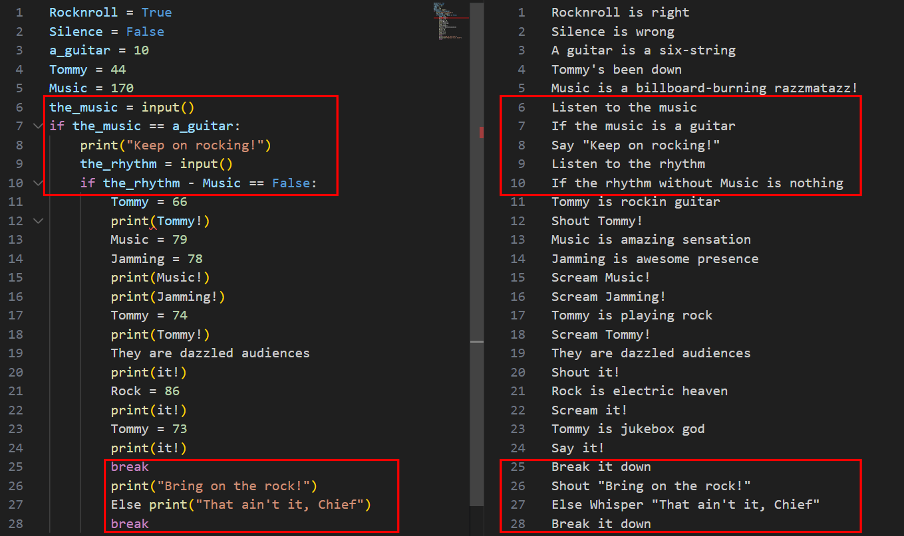
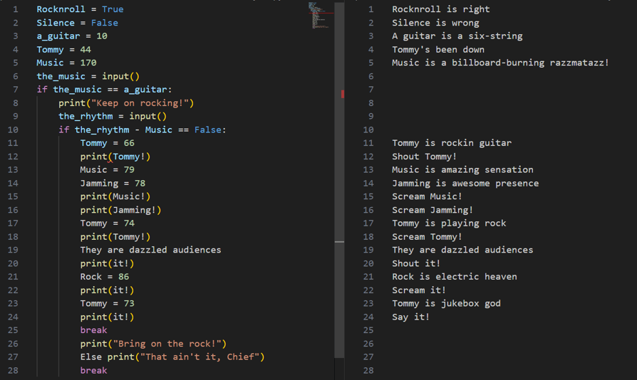

# Lessons
- `Rockstar Programming Language`
- how to battle with unfamiliar languages 
    - use `transcompiler`
    - use diff for a bug generated by transcompile
    - use "guess"


# Memo  
1. run the rockstar code, but it didn't work  
https://web.archive.org/web/20190522030819/https://codewithrockstar.com/code  

2. understand the code  
    I want to skip a time for learning the usage of `Rockstar Programming Language.`  
    Then I use a transcompiler that translates it into python.
    https://github.com/yyyyyyyan/rockstar-py
    - preparation
        ```zsh
        $ mkdir ./virtual_py3.10_rockstar
        $ virtualenv -p python3.10 virtual_py3.10_rockstar
        $ source ./virtual_py3.10_rockstar/bin/activate
        ## After this ctf,
        ## type "deactivate" and
        ## delete "virtual_py3.10_rockstar" folder
        ```
    - transcompile
        ```zsh
        $ rockstar-py -i lyrics.txt -o lyrics.py
        ```
    - read  
        lyrics.py is not good as python code.  
        It may be broken on the way to be transcompiled.  
        I could fix it based on my "guess", but I take another solution for accuracy and saving my time.
3. create runnable rockstar code  
    I guess that there are some unnecessary code in lyrics.txt.  
    To compare lyrics.txt with lyrics.py, I identify and remove the code.
      
    the result of removing
    

4. run it on the online site provided by this ctf  
https://web.archive.org/web/20190522020843/https://codewithrockstar.com/online  
    ```
    Rocknroll is right              
    Silence is wrong                
    A guitar is a six-string        
    Tommy's been down               
    Music is a billboard-burning razzmatazz!
    Tommy is rockin guitar
    Shout Tommy!                    
    Music is amazing sensation 
    Jamming is awesome presence
    Scream Music!                   
    Scream Jamming!                 
    Tommy is playing rock           
    Scream Tommy!       
    They are dazzled audiences                  
    Shout it!
    Rock is electric heaven                     
    Scream it!
    Tommy is jukebox god            
    Say it! 
    ```
    ->
    ```
    66
    79
    78
    74
    79
    86
    73
    ```
    convert it
    ```py
    numbers = [66, 79, 78, 74, 79, 86, 73]

    result = ''.join(chr(num) for num in numbers)
    flag = "picoCTF{" + result + "}"
    print(flag)
    # picoCTF{BONJOVI}
    ```


