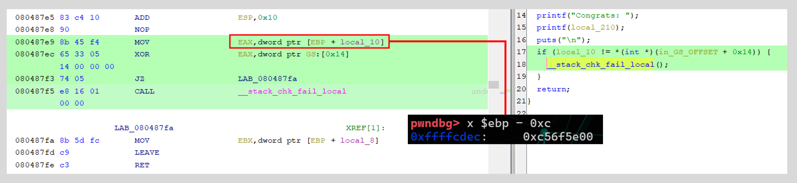
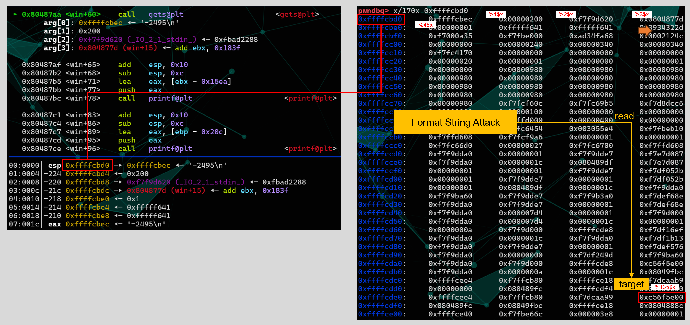
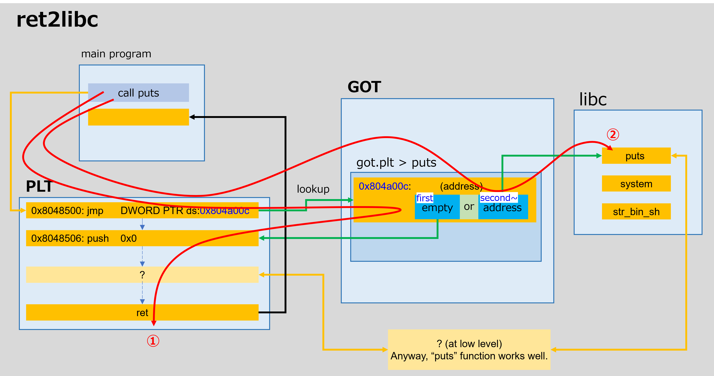

# Lessons
- `Return-to-libc` / `ret2libc`  
    - https://www.ired.team/offensive-security/code-injection-process-injection/binary-exploitation/return-to-libc-ret2libc  
    - https://systemoverlord.com/2017/03/19/got-and-plt-for-pwning.html  
    - https://blog.y011d4.com/20201115-gdb-plt-got  
    - `got` and `plt`  

    - the way to find offset in `libc`
        - https://libc.blukat.me/

- `Format String Attack`  
    - https://gist.github.com/hhc0null/08c43983b4551f506722  
    - https://robin-sandhu.medium.com/understanding-the-format-string-vulnerability-b2957630d886
    - https://www.slideshare.net/icchyr/format-string-attack
    - `%n`  
        There is another string of `%hn`  
- Stack Cookie  
- `RELRO`  
    RELRO is a protection to stop any GOT overwrites from taking place, and it does so very effectively. There are two types of RELRO, which are both easy to understand.  
    - `Partial RELRO`  
    Partial RELRO simply moves the GOT above the program's variables, meaning you can't overflow into the GOT. This, of course, does not prevent format string overwrites.  
    - `Full RELRO`  
    Full RELRO makes the GOT completely read-only, so even format string exploits cannot overwrite it. This is not the default in binaries due to the fact that it can make it take much longer to load as it need to resolve all the function addresses at once.
    - Ref
        - https://miso-24.hatenablog.com/entry/2019/10/16/021321  
        - https://ir0nstone.gitbook.io/notes/types/stack/relro  
- `rand` vs. `rand()`
    ```c
    int random_number = rand;
    ```
    ```c
    int random_number = rand();
    ```
    In C, the rand function from the standard library generates a random number without taking any arguments. While it's common to include parentheses when calling functions in C, the rand function is a special case where you can omit them. So both rand() and rand are correct forms to use the rand function. However, using rand() with parentheses is generally preferred as it makes the function call clearer and more explicit.

# Memo
1. check
    ```zsh
    $ file ./vuln
    ./vuln: ELF 32-bit LSB executable, Intel 80386, version 1 (SYSV), dynamically linked, interpreter /lib/ld-linux.so.2, for GNU/Linux 3.2.0, BuildID[sha1]=24c4fa8500082ef048a420baadc6a3d777d39f34, not stripped
    $ checksec --file=./vuln --output=json | jq .
    {
    "./vuln": {
        "relro": "full",
        "canary": "yes",
        "nx": "yes",
        "pie": "no",
        "rpath": "no",
        "runpath": "no",
        "symbols": "yes",
        "fortify_source": "no",
        "fortified": "0",
        "fortify-able": "3"
    }
    }
    ```
2. ghidra

3. gdb  
    - stage 1    
        The random number in source code is a fixed value.  
        The first step is to find the value with a debugger.  
        ```
        break *0x080486dc <do_stuff+125>
        break  <do_stuff+187>
        ```
        A checking point is 0x0804871a.  
        ```
        b   0x80486dc <do_stuff+125>    add    esp, 0x10
            0x80486df <do_stuff+128>    sub    esp, 0xc
            0x80486e2 <do_stuff+131>    lea    eax, [ebp - 0x20c]
            0x80486e8 <do_stuff+137>    push   eax
            0x80486e9 <do_stuff+138>    call   atol@plt                     <atol@plt>
                ↓
            0x80486ee <do_stuff+143>    add    esp, 0x10
            0x80486f1 <do_stuff+146>    mov    dword ptr [ebp - 0x210], eax
            0x80486f7 <do_stuff+152>    cmp    dword ptr [ebp - 0x210], 0
            0x80486fe <do_stuff+159>    jne    do_stuff+181                     <do_stuff+181>
                ↓
            0x8048714 <do_stuff+181>    mov    eax, dword ptr [ebp - 0x210]
        b   0x804871a <do_stuff+187>    cmp    eax, dword ptr [ebp - 0x214]
            0x8048720 <do_stuff+193>    jne    do_stuff+225                     <do_stuff+225>
                ↓
            0x8048740 <do_stuff+225>    sub    esp, 0xc
            0x8048743 <do_stuff+228>    lea    eax, [ebx - 0x1604]
            0x8048749 <do_stuff+234>    push   eax
            0x804874a <do_stuff+235>    call   puts@plt                     <puts@plt>
        ```
        e.g. input = 3  
        ```
        pwndbg> x $ebp - 0x214
        0xffffcbe4:     0xfffff641
        pwndbg> p/x $eax
        $3 = 0x3
        ```
        e.g. input = -1  
        ```
        pwndbg> x $ebp - 0x214
        0xffffcbe4:     0xfffff641
        pwndbg> p/x $eax
        $4 = 0xffffffff
        ```
        result from my test   
        ```zsh
        (x $ebp - 0x214)    input
        0xfffff000 	        -4096
        0xfffff060	        -4000
        0xfffff254	        -3500
        0xfffff63c	        -2500
        0xfffff641	        ... -2495
        0xfffff646	        -2490	
        0xfffff704	        -2300
        0xfffff830	        -2000
        0xfffffa24	        -1500
        ```
        input : -2496
    - stage 2  
        - stage 2-1 : check stack cookie
            format string attack -> overwrite a value for checking stack and bypass the BOF check  
            ```
            %135$x
            ```
            ```
            pwndbg> x $ebp - 0xc
            0xffffcdec:     0x744ec000
            ```
              
              
        - stage 2-2 : ret2libc          
          
4. exploit
    - solver1.py ... check the fixed random value with BFA
    - solver2.py ... main

# Ref  
- https://gist.github.com/hhc0null/08c43983b4551f506722  
- https://captain-woof.medium.com/picoctf-guessing-game-2-walkthrough-ret2libc-stack-cookies-6f9fc39273bf  
- https://gist.github.com/aidnzz/5631bc65c38318fe74dd23e0390c9633  
- https://gist.github.com/captain-woof/baed815ae5caddd0152ccc99167cae3b  
- https://www.ired.team/offensive-security/code-injection-process-injection/binary-exploitation/return-to-libc-ret2libc