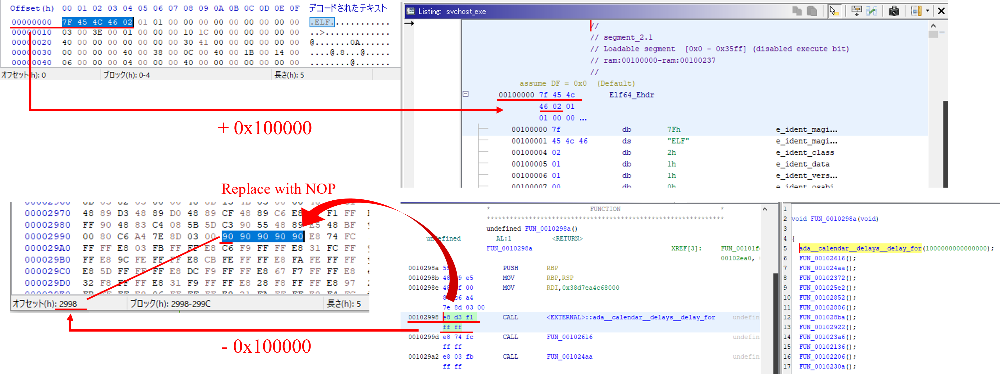

# Lesson
- `ldd`
    - vs. "not found"
        ```bash
        $ cd /hoge
        # check libararies
        $ ldd ./test_binary
            ...
            libgnat-7.so.1 => not found
            ...
        # get the library from Web
        $ wget http://hogehoge/target.deb
        # decompress the file
        $ dpkg-deb -x target.deb ./
        # check download contents
        $ ls ./usr/lib/x86_64-linux-gnu
            libgnarl-7.so.1  libgnat-7.so.1
        # register the directory for search destination of library 
        $ sudo vim /etc/ld.so.conf.d/my.conf
            /hoge/usr/lib/x86_64-linux-gnu
        # update ldd
        $ sudo ldconfig
        # check result
            ...
            libgnat-7.so.1 => /hoge/usr/lib/x86_64-linux-gnu/libgnat-7.so.1
            ...
        ```

# Memo
1. fix libraries
    ```bash
    $ ldd svchost_exe
        linux-vdso.so.1 (0x00007ffd615dd000)
        libgnat-7.so.1 => not found
        libc.so.6 => /lib/x86_64-linux-gnu/libc.so.6 (0x00007ffaa8bd8000)
        /lib64/ld-linux-x86-64.so.2 (0x00007ffaa90eb000)
    $
    # get libgnat-7.so.1
    # https://ubuntu.pkgs.org/20.04/ubuntu-universe-arm64/libgnat-7_7.5.0-6ubuntu2_arm64.deb.html
    $ wget http://archive.ubuntu.com/ubuntu/pool/universe/g/gcc-7/libgnat-7_7.5.0-6ubuntu2_amd64.deb
    $ dpkg-deb -x libgnat-7_7.5.0-6ubuntu2_amd64.deb ./
    # check download contents
    $ ls ./usr/lib/x86_64-linux-gnu
        libgnarl-7.so.1  libgnat-7.so.1
    $
    # register the directory for search destination of library 
    $ cat /etc/ld.so.conf
        include /etc/ld.so.conf.d/*.conf
    $ sudo vim /etc/ld.so.conf.d/my.conf
        /hogehoge/piyopiyo/CTF/picoCTF2021/Reverse_Engineering/Hurry_up_Wait/usr/lib/x86_64-linux-gnu
    $
    # update ldd
    $ sudo ldconfig
    $
    # check result
    $ ldd ./svchost_exe
        linux-vdso.so.1 (0x00007fffa0192000)
        libgnat-7.so.1 => /hogehoge/piyopiyo/CTF/picoCTF2021/Reverse_Engineering/Hurry_up_Wait/usr/lib/x86_64-linux-gnu/libgnat-7.so.1 (0x00007f076ee7d000)
        libc.so.6 => /lib/x86_64-linux-gnu/libc.so.6 (0x00007f076ec55000)
        libgcc_s.so.1 => /lib/x86_64-linux-gnu/libgcc_s.so.1 (0x00007f076f450000)
        /lib64/ld-linux-x86-64.so.2 (0x00007f076f487000)
    ```
2. ghidra and binary editor  
    - find a suspicious function  
    - try to skip the function with NOP
    - replace with NOP and save as "svchost_exe_nop"  
    
3. run
    ```bash
    $ ./svchost_exe_nop
    picoCTF{d15a5m_ftw_a82650a}
    ```
4. clean after ctf
    ```bash
    $ sudo rm /etc/ld.so.conf.d/my.conf
    $ sudo ldconfig
    $
    # check result
    $ ldd svchost_exe
        linux-vdso.so.1 (0x00007ffe103d5000)
        libgnat-7.so.1 => not found
        libc.so.6 => /lib/x86_64-linux-gnu/libc.so.6 (0x00007f8aac5d8000)
        /lib64/ld-linux-x86-64.so.2 (0x00007f8aacb5f000)
    # OK
    ```

# Ref
- https://tsalvia.hatenablog.com/entry/2021/04/08/110000