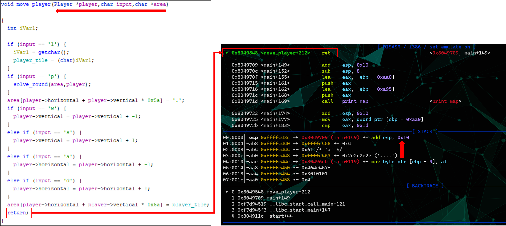
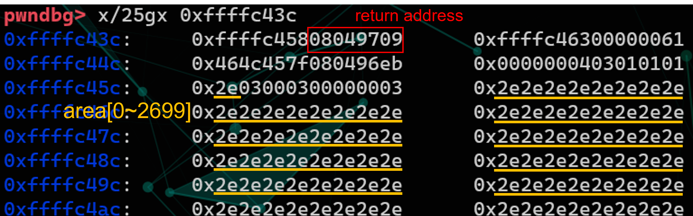
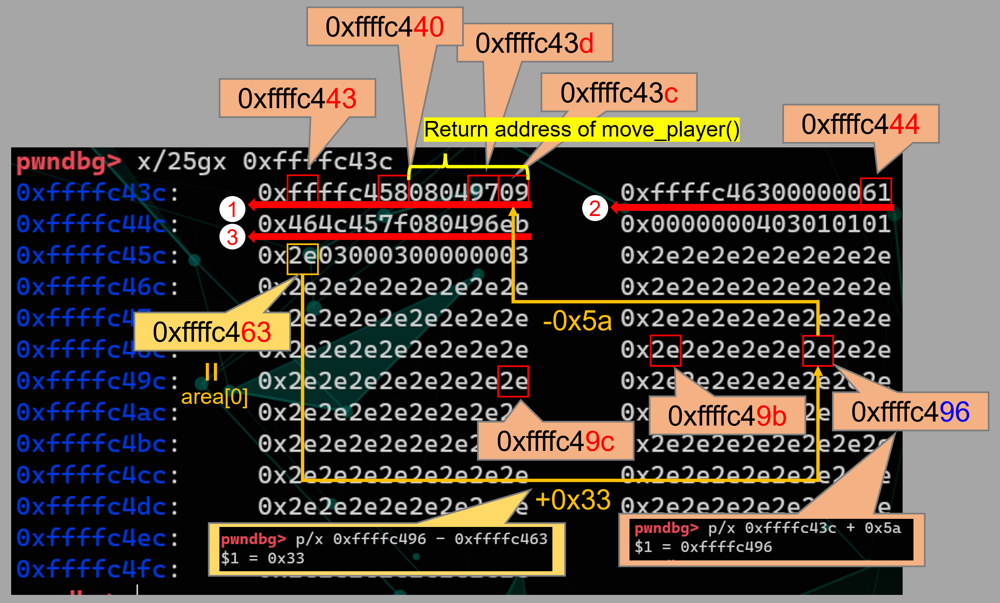
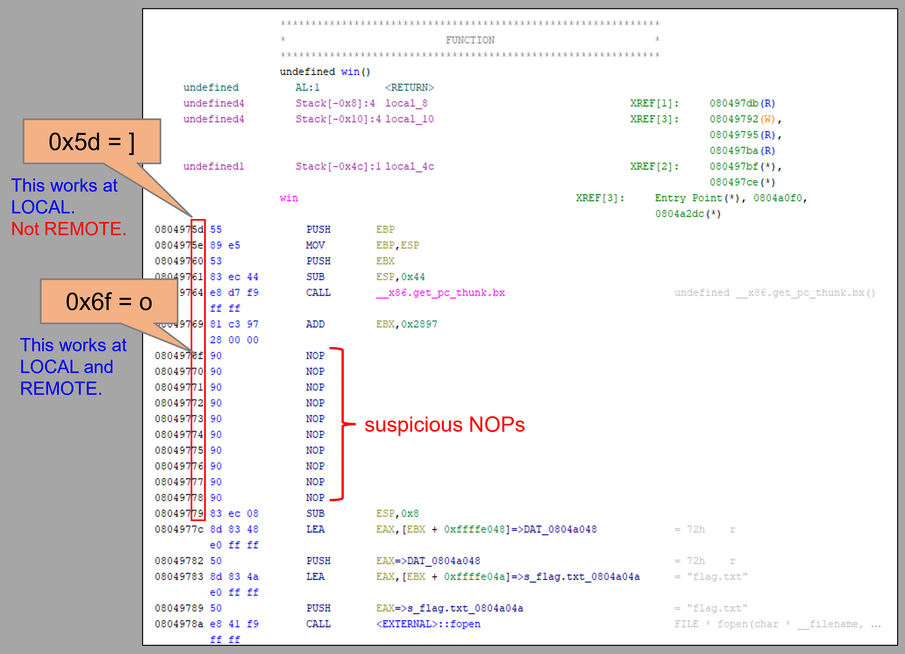

# Lesson
- debugger in `pwntools`  
  - `gdb.attach(r)`  
    ```python
    r = conn()
    gdb.attach(r)
    r.interactive()
    ```
- difference between LOCAL and REMOTE using exploit with `pwntools`  
    - a risk of `recvuntil()`  
        If an output you wait shows up unexpectedly, your next code on `pwntools` for exploit might not work well.  
        - Countermeasure: Minimize the number of send and recv interactions whenever possible.
# Memo
1. check
```zsh
$ file game
game: ELF 32-bit LSB executable, Intel 80386, version 1 (SYSV), dynamically linked, interpreter /lib/ld-linux.so.2, BuildID[sha1]=a78466abe166810914fe43e5bd71533071ad919e, for GNU/Linux 3.2.0, not stripped
$
$ checksec --file=game --output=json | jq .
{
  "game": {
    "relro": "partial",
    "canary": "no",
    "nx": "yes",
    "pie": "no",
    "rpath": "no",
    "runpath": "no",
    "symbols": "yes",
    "fortify_source": "no",
    "fortified": "0",
    "fortify-able": "2"
  }
}
```

2. ghidra

3. exploit  
- area[0] : 0xffffc463  
- win : 0804975d  
- valid return address of move_player() : 08049709  
  
  
calcurate address carefully and cautiously.  
  
where to jump  
  

4. write the solver